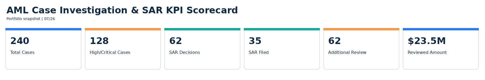
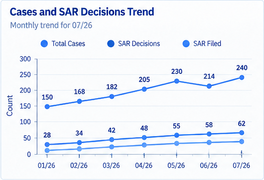
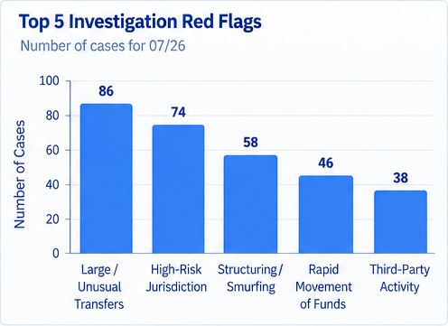

# AML Case Investigation & SAR Decision Analytics

Project 5 in the Financial Crime Analytics portfolio.

This project is intentionally different from Project 1. Project 1 focuses on transaction-monitoring alerts. Project 5 begins after an alert has been escalated into an investigation case.

## Scale
- 900 synthetic customers
- 22,000 synthetic transactions
- 240 investigation cases
- 62 SAR recommendations / filing decisions

## Workflow
Escalated alert → case creation → KYC review → transaction lookback → red-flag analysis → investigation summary → disposition → SAR decision.

## Tools
SQL, Python, Tableau, Streamlit.

## Separate KPI Visualization
The project includes a standalone KPI scorecard:
1. Total Cases
2. High/Critical Cases
3. SAR Decisions
4. SAR Filed
5. Additional Review
6. Reviewed Amount

## Executive Dashboard
Exactly six analytical visualizations:
1. Case & SAR Trends
2. Case Disposition donut
3. Top Investigation Red Flags
4. Case Aging Heatmap with numbers inside cells
5. Reviewed Amount vs Case Risk scatter
6. SAR Conversion by Case Type

The final approved dashboard uses one visualization color only: blue, with lighter and darker blue shades where separation is required. Dates use MM/YY such as 07/26.

## Dashboard Preview

### KPI Scorecard

### Executive Dashboard

### Cases and SAR Decisions Trend

### Top 5 Investigation Red Flags

## Disclaimer
All customers, transactions, investigation cases, notes, and SAR decisions are synthetic and created for educational portfolio use only.

