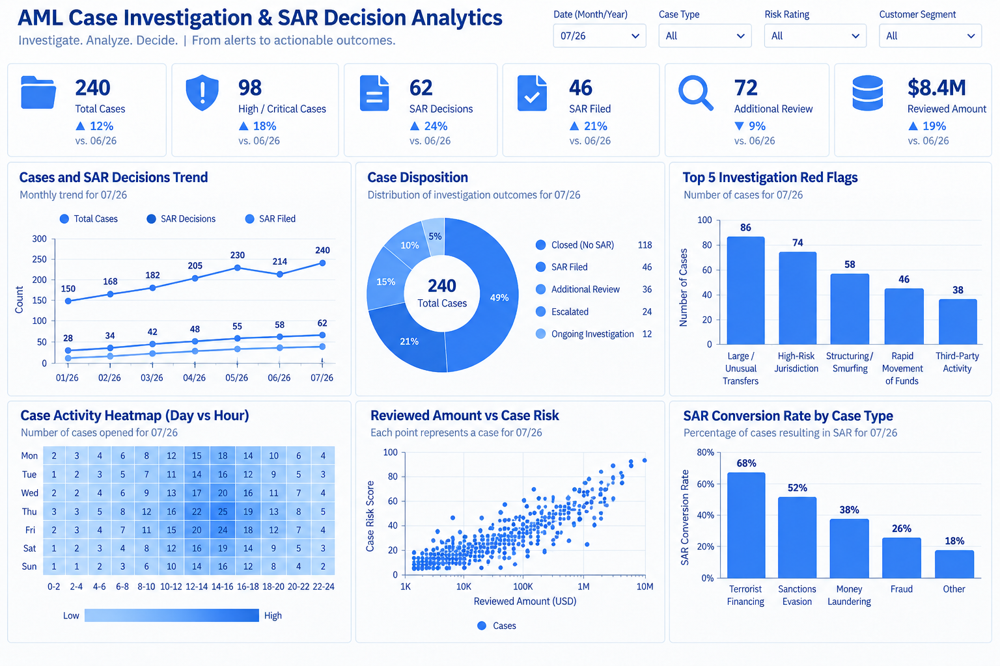

# AML Case Investigation & SAR Decision Analytics

**Financial Crime Analytics Portfolio Project**

An end-to-end AML investigation and decision-support project using **Python, SQL, Tableau, and Streamlit** to connect customer/KYC context, transaction lookback analysis, investigation red flags, case prioritization, case disposition, and SAR decision outcomes.

> **Portfolio note:** All data in this repository is synthetic and created for educational and portfolio demonstration.

---

## Project Objective

This project demonstrates how an AML / Financial Crime analyst can move from an escalated investigation case to a documented, defensible outcome:

```text
Customer / KYC Context
        ↓
Transaction Review
        ↓
Escalated Investigation Case
        ↓
Transaction Lookback
        ↓
Red-Flag & Risk Analysis
        ↓
Investigation Summary
        ↓
Case Disposition
        ↓
SAR Recommendation / Filing Decision
        ↓
Portfolio & Executive Reporting
```

The project combines case-level investigation logic with analytics so reviewers can see both **hands-on AML investigation thinking** and **data-analysis capability**.

---

## Executive Dashboard



The Tableau executive dashboard and Streamlit application are aligned to the same processed investigation data.

### Verified Portfolio KPIs

| KPI | Result |
|---|---:|
| Total Cases | **240** |
| High / Critical Cases | **128 (53.3%)** |
| SAR Decisions | **62 (25.8%)** |
| SAR Filed | **35 (14.6%)** |
| SAR Filing Rate among SAR Decisions | **56.5%** |
| Additional Review | **62 (25.8%)** |
| Reviewed Amount | **$23.5M** |

### Dashboard Views

The executive dashboard highlights:

- Cases & SAR Decisions Trend
- Case Disposition
- Top 5 Investigation Red Flags
- Case Aging Distribution
- Reviewed Amount vs. Case Risk
- SAR Decision Rate by Case Type
- Key Insights & Recommended Actions

---

## Key Portfolio Insights

- **53.3% (128)** of cases are High/Critical, showing a meaningful concentration of elevated-risk investigations.
- **62** cases reached a SAR decision and **35** resulted in a filing, a **56.5% filing rate among SAR decisions**.
- **25.8% (62)** of cases were escalated for additional review.
- The most common investigation red flags are **Unusual Volume, Funnel Activity, High-Risk Jurisdiction, Activity Inconsistent with Profile, and Structuring**.
- The portfolio represents approximately **$23.5M** in reviewed activity.

---

## EDA & Feature Engineering

The Jupyter workflow demonstrates a structured exploratory-data-analysis and feature-engineering process while preserving suspicious or unusual values for investigation rather than automatically removing them.

### EDA Workflow

1. Load / Confirm Data
2. Dataset Review
3. Missing Value Analysis
4. Duplicate Validation
5. Datatype & Column Checks
6. Column Standardization
7. Data Quality Checks
8. Outlier Detection
9. Range Validation
10. KPI Validation
11. Feature Engineering
12. Business Rule Validation
13. Summary Statistics
14. Analysis-Ready Export
15. Insight Generation

### Analytical Features Used

The project uses or derives investigation-oriented fields such as:

- Case Risk Score
- Case Age
- Reviewed Transaction Count
- Reviewed Amount
- High-Risk Transaction Count
- Red-Flag Count
- Primary Red Flag
- SAR Flag
- Activity Month
- Risk / priority segmentation

In financial-crime analytics, outliers can represent meaningful suspicious activity. The workflow therefore **flags unusual values for investigation instead of automatically deleting them**.

---

## SQL Analysis

The SQL layer demonstrates practical investigation and portfolio queries, including:

- Investigator priority queue
- High / Critical case review
- SAR recommendation / filing population
- Additional-review queue
- Case aging
- SAR conversion by case type
- Red-flag distribution
- PEP / High-KYC-risk review
- Transaction lookback analysis
- Reviewed amount vs. risk
- Monthly case trend
- SAR filing queue

---

## Streamlit Investigation Application

The Streamlit app complements the executive Tableau dashboard with an interactive analyst workflow.

### Global Filters

The app uses dashboard-aligned filters for:

- Date Range
- Case Type
- Risk Rating
- Customer Segment

These filters update the portfolio metrics and analytical views across the application.

### Investigation Workflow

The app includes:

- **Executive Overview** — synchronized KPI scorecard and dashboard analytics
- **Case Queue** — risk- and age-prioritized investigation population
- **Case 360** — case-level KYC context, red flags, investigation summary, and decision
- **Transaction Lookback** — transactions linked to the selected case
- **SAR Decisions** — SAR decision and filing records
- **Tableau Gallery** — final executive dashboard image

---

## Tools & Technologies

| Tool | Use |
|---|---|
| **Python / Pandas** | EDA, validation, feature engineering, KPI verification, case analysis |
| **SQL** | Investigation queues, aging, red flags, lookback, and SAR analysis |
| **Tableau** | Executive investigation dashboard |
| **Streamlit** | Interactive Case 360, transaction lookback, portfolio analytics, and decision support |
| **Jupyter Notebook** | Reproducible EDA and analytical workflow |
| **Git / GitHub** | Version control and portfolio presentation |

---

## Data Model

The analytical workflow connects three core processed datasets:

- `investigation_cases.csv` — **240 cases / 23 fields**
- `case_transactions.csv` — **5,095 case-linked transactions / 9 fields**
- `sar_decisions.csv` — **62 SAR-decision records / 12 fields**

Primary relationships:

```text
investigation_cases.case_id
        ↕
case_transactions.case_id
        ↕
sar_decisions.case_id
```

`customer_id` provides additional customer-level linkage across the investigation workflow.

See `docs/data_dictionary.md` for field definitions and dataset relationships.

---

## Repository Structure

```text
Case-SAR-Decision/
├── app/
│   └── streamlit_app.py
├── data/
│   └── processed/
│       ├── investigation_cases.csv
│       ├── case_transactions.csv
│       └── sar_decisions.csv
├── docs/
│   └── data_dictionary.md
├── images/
│   └── 02_executive_dashboard.png
├── notebooks/
│   └── aml_case_sar_analysis.ipynb
├── sql/
│   └── aml_case_sar_queries.sql
├── tableau/
│   └── AML_Case_SAR_Analytics.twb
├── .gitignore
├── .python-version
├── pyproject.toml
├── requirements.txt
├── uv.lock
└── README.md
```

---

## How to Run

```bash
git clone https://github.com/Denis0242/Case-SAR-Decision.git
cd Case-SAR-Decision
pip install -r requirements.txt
streamlit run app/streamlit_app.py
```

If you use `uv`:

```bash
uv sync
uv run streamlit run app/streamlit_app.py
```

---

## Skills Demonstrated

**AML / Financial Crime:** AML case investigation, transaction lookback, KYC context review, red-flag identification, case risk assessment, investigation prioritization, case disposition, SAR decision analytics, investigation narrative review, and financial-crime decision support.

**Data & Analytics:** exploratory data analysis, data-quality validation, feature engineering, SQL, Python/Pandas, KPI development, risk segmentation, pattern/trend analysis, and case-level analytics.

**Reporting & Visualization:** Tableau, Streamlit, Case 360 reporting, executive KPI reporting, interactive analytics, and data storytelling.

---

## Disclaimer

This project uses **synthetic data** created for educational and portfolio purposes. No real customer, account, transaction, investigation case, SAR, analyst, or confidential financial-institution data is included.

Case-risk scores, red flags, investigation summaries, dispositions, SAR recommendations, filing decisions, and analytical thresholds are illustrative. They demonstrate AML investigation and financial-crime analytics workflows and should not be interpreted as actual bank policies, regulatory determinations, or regulatory filings.
